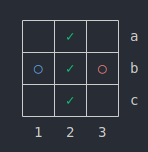
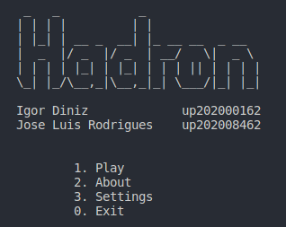

# Hadron Group 6

Hadron is a game played by two people over a game board.
This project implemented said game using Prolog.

## Members

| Member | Number | Contribution |
|--------|--------|--------------|
| Igor Rodrigues Diniz | up202000162 | 35% |
| José Luís Cunha Rodrigues | up202008462 | 65% |

## Steps to execute

Assuming SICStus Prolog is installed and set up:

```bash
$ cd src
$ sicstus
| ?- [main].
| ?- play.
```

## Game description

[Hadron](https://www.marksteeregames.com/Hadron_rules.pdf) is a two player game played on a square board, initially empty.
The two players,  Red and Blue, take turns adding  their own tiles  to the board, one tile per turn, starting with Red.

### How to place pieces? 

You  can  place a tile  in isolation, not adjacent to anything.
Or  you  can  place  a  tile  to form  one (horizontal or  vertical)  adjacency with a  friendly tile and one with an enemy tile. 
Or you can form two adjacencies with friendly  tiles and  two adjacencies
with enemy tiles.

[Mark Steere](https://www.marksteeregames.com/) designed Hadron in August, 2022.

<p align="center">
    
</p>

## Implementation


### Internal Game State Representation

The Game is represent by a squared board and a player.
This information is kept on a list (`GameState = [Player, Board]`).
Player will vary between 1 (Red pieces) and 2 (Blue pieces).
Thus, the board will be a list of lists, where each atom will be either 0, for empty squares, or a player number, for placed pieces.
Because red pieces go first, this would be the game state before the game starts:

```
[
    1,
    [[0,0,0],
     [0,0,0],
     [0,0,0],
    ]
]
```

As the game progresses, squares would be filled, as such:


```
[
    2,
    [[1,0,2],
     [0,0,0],
     [1,0,0],
    ]
]
```

The game is over when there are no more valid moves:

```
[
    1,
    [[1,0,2],
     [0,1,2],
     [1,0,0],
    ]
]
```

### Interface

The program includes a section of interface specific code. 
This resides inside the `main` module, which is not going to be described in detail.
Briefly, after `play` is called, it will redirect the program's flow with `step(State, NextState)`. 
State determines the current stage in execution (e.g. interface page) and will change according to user input.

<p align="center">
    
</p>

On the other hand, the game works by recursively looping with (`game_loop`) until it's over.
Before the game starts, `initial_state(Size, GameState)` is called so it can create a board of variable size and define the starting game state.
For each execution of the loop, `display_game(GameState)` shows the current board and player. 
We used color codes and unicode to format special characters and help visualization.

### Moving

For each turn, `get_move` predicate is called.
It will call either `get_move_user` or `get_move_bot` depending on whose turn it is.
Internally, moves are represented by its coordinates. 
To put a piece on the first column and second row would be `[1, 0]`.
Because this is not very user friendly, the interface displays moves with letters and numbers. `[1, 0]` would be `b1`.
Therefore, we have to do this conversion internally. 
For that, we use `atom_chars` and convert letters to numbers using `char_code`.

To see if moves are valid, we first calculate the list of all valid modes with `valid_moves` and check if the already parsed user input is in the list.
For the bot's turn it will choose a move from the list, as explained bellow.

When the move is chosen and properly validated, the program calls `move(GameState, Move, GameState)`. 
This is responsible to fill the board with the newly placed piece, as well as changing turns.

### Valid Moves

A key component to the game is to determine the list of valid moves.
This is done using `valid_moves(Board, ListOfMoves)`. 
Player is not included as validation of moves is not dependant on whose turn is it.
The term iterates all positions of the board and checks if the occurrences of red and blue pieces match.
The ones that do are included in a list to be used by both player and the bot.

### Game over

The game is over when the list of valid moves is empty. 
Then, the last player to move wins.

### Board evaluation

After pieces are placed in the board, their color doesn't really matter in a way that is more advantageous for one player.
Because valid moves are the same for both players, it's hard to judge the value of the board, as it will be the same for the opponent.
Also, as the game is won by placing the last piece, there really isn't a straightforward evaluation to value a single board, as placing a piece can both create and destroy moving opportunities.

To get around this problem, we decided to evaluate the board for amount of moves available. 
So, the idea would be for a board that provides fewer moves would be better.
This means to play in a way that leaves the opponent with fewer options and works even better when paired with backtracking.

### Computer moves

The bot is provided with the list of available moves.
From those, it will choose one to use against the player.

For the first level, this is completely random. 
For levels 2-4, we used the Minimax algorithm to work out what the best move was.
The idea is to play out the game and try to maximize the value for the bot and minimize it for the player.
This works great as the bot is equipped with lots of insight on each move while choosing.
The different levels are different depths on which the algorithm will search (i.e. amount of turns).
Therefore, for level 2 difficulty (depth 1), the algorithm will take a greedy approach, as it only analyzes the next move.

## Conclusions

The development of this game taught us a lot about using Prolog and logic programming.
Because of our lack of experience with the paradigm, it was a slow start but, in the end, some tasks turned out to become pretty easy using this.

The greatest challenged faced was calculating the board's value.
The nature of the game made us uncertain of what to use and, even though the bot is working fine at the moment, the board evaluation still has room for improvement.

## Bibliography

[Hadron Rules](https://www.marksteeregames.com/Hadron_rules.pdf)